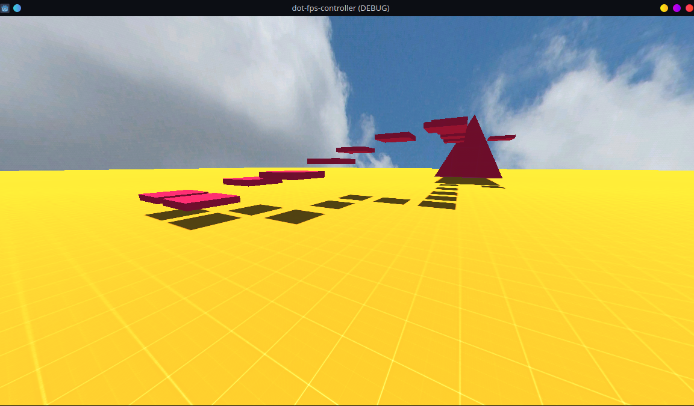
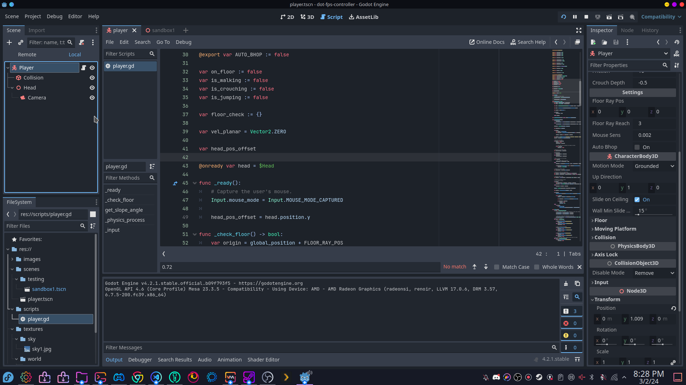

An **open source** 3D first-person player controller for [Godot Engine](https://godotengine.org/) (version *4.3* and should work with *4.2*). This controller currently supports air strafing, bunny hopping, crouching, walking, and more!

This asset is a big work in progress and we plan on adding more features along with improving the current player movement in the future as we develop our own [open source games](https://moddingcommunity.com/forum/335-dot-games/).

## Features
* Air strafing
* Bunny-hopping (with auto-hop option)
* Crouching
* Sprinting
* Walking
* FPS and speed 2D labels

View our roadmap [here](https://github.com/orgs/modcommunity/projects/8)!

## Godot Input Actions
The following input actions need to be added to the Godot project via *Project -> Project Settings -> Input Map* for the controller to work properly.

| Action | Description |
| ------ | ----------- |
| `player_l` | Moves the player to the left. |
| `player_r` | Moves the player to the right. |
| `player_f` | Moves the player forwards. |
| `player_b` | Moves the player backwards. |
| `player_jump` | The player jump action. |
| `player_crouch` | The player crouch action. |
| `player_shift` | The player shift action. |
| `player_walk` | The player walk action. |

**Note** - Mouse wheel up button is supported for the `player_jump` input!

**Note** - The `player_crouch`, `player_shift`, and `player_walk` inputs works as press and release. For example, the player must hold the input down to crouch and release it when they want to stop crouching.

## Controller Settings
The following are variables exported by the player controller that can be modified outside of the controller.

### General
| Setting | Default | Description |
| ------- | ------- | ----------- |
| `verbose` | `0` | The verbose level (determines what is printed to the Godot debug console). |
| `mouse_sens_x` | `0.3` | The mouse sensitivity while looking left and right. |
| `mouse_sens_y` | `0.3` | The mouse sensitivity while looking up and down. |
| `max_look_angle_down` | `-90` | The max look angle down. |
| `max_look_angle_up` | `90` | The max look angle up. |
| `max_slope_angle` | `deg_to_rad(45)` | The max slope angle. |
| `crouch_depth` | `-0.5` | The depth to apply when crouching. |
| `crouch_lerp_speed` | `12.0` | The lerp speed when crouching. |

### Feature Settings
| Setting | Default | Description |
| ------- | ------- | ----------- |
| `can_noclip` | `false` | Whether the player can noclip (not yet implemented). |
| `can_crouch` | `true` | Whether the player can crouch. |
| `can_sprint` | `true` | Whether the player can sprint. |
| `can_walk` | `true` | Whether the player can walk. |
| `can_auto_hop` | `false` | Whether the player can auto-hop by holding down space. |

### Movement Settings
| Setting | Default | Description |
| ------- | ------- | ----------- |
| `max_speed` | `7` | The max speed. |
| `speed_left` | `0.100` | The left speed. |
| `speed_right` | `0.100` | The right speed. |
| `speed_forward` | `0.100` | The forward speed. |
| `speed_back` | `0.100` | The backwards speed. |
| `crouch_speed_multiplier` | `0.4` | The crouch speed multiplier. |
| `walk_speed_multiplier` | `0.4` | The walk speed multiplier. |
| `sprint_speed_multiplier` | `1.5` | The sprint speed multiplier. |
| `accelerate` | `3` | The accelerate speed. |
| `air_accelerate` | `100` | The accelerate speed while in air. |
| `max_air_speed` | `1` | The max speed while in the air. |
| `friction` | `1.5` | The amount of friction to apply. |
| `stop_speed` | `10` | The stop speed. |
| `gravity` | `25` | The amount of gravity to apply. |
| `max_velocity` | `40000` | The maximum velocity. |
| `jump_height` | `1` | The jump height. |

## Preview
Here are some GIFs and images showcasing the controller as of *3-2-24*.

### Video

### Images

## Credits
* [Christian Deacon](https://github.com/gamemann)
* [BleyChimera](https://github.com/BleyChimera) - Their code was a base for this controller with additions/changes. Thank you!
* [Prototype Textures](https://www.kenney.nl/assets/prototype-textures)